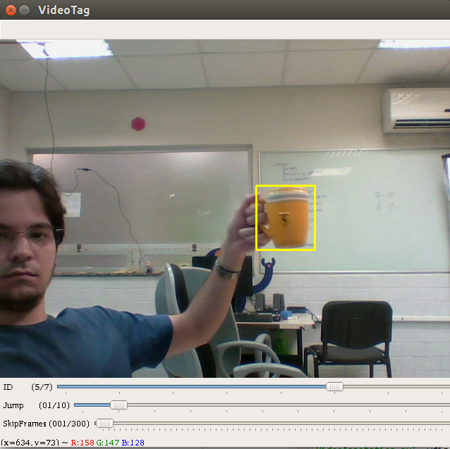

# Simple Video Annotation

> A simple Video annotation made with python + opencv for detection in yolo format



## Installation

```sh
#TODO
You will need OpenCV with ffmpeg lib
```

## Usage example

```sh
python VideoAnnotation.py
```

## Controls:

* q - Quit
* Mouse Left - Create new BoundBox, drag to change the dimension
* Mouse Right - Erase actual BoundingBox
* WASD - Move the BoundBox
* 8456 - Change width and height
* Space - Next frame

## Variables -- Trackbar

* ID - Id of the label
* Jump - How many pixels WASD/8456 will change
* Skip - How many frames will be skipped

## Tree
Givem a video file, it will create:

```
.
└── VideoFolder (The same name of the video file)
    ├── Ground  (Fold of ground imagens with BoundBox)
    ├── JPEGImages (Fold of imagens without BoundBox)
    ├── labels (Fold with the .txt labels files in yolo format)
 	└──	imgList.txt (List with full directory of images inside JPEGImages folder)
```

### Label Format

    (ID) (absoluteX/imgWidth) (absoluteY/imgHeight) (absoluteWidth/imgWidth) (absoluteHeight/imgHeight)

    Example: 
	  Class Id = 0
	  absoluteX = 50  (X of the center of the BoundBox)
	  absoluteY = 50  (Y of the center of the BoundBox)
	  absoluteWidth = 100 (Width of the BoundBox)
	  absoluteHeight = 100 (Height of the BoundBox)
	  imgWidth = 400  (Image width)
	  imgHeight = 400 (Image Height)

	         0 50/400 50/400 100/400 100/400
	  Label: 0 0.125  0.125   0.25    0.25
	

### TODO
	
	1. Organize the code
	2. Add suport for multi BoundBox in the same image
	3. Make automatic BoundBox

### Please Feel Free to Contact Us!

**Carlos Pena** ([GitHub :octocat:](https://github.com/CarlosPena00))
  
  
**chcp@cin.ufpe.br**

**Heitor Rapela** ([GitHub :octocat:](https://github.com/heitorrapela))
  
  
**hrm@cin.ufpe.br**


