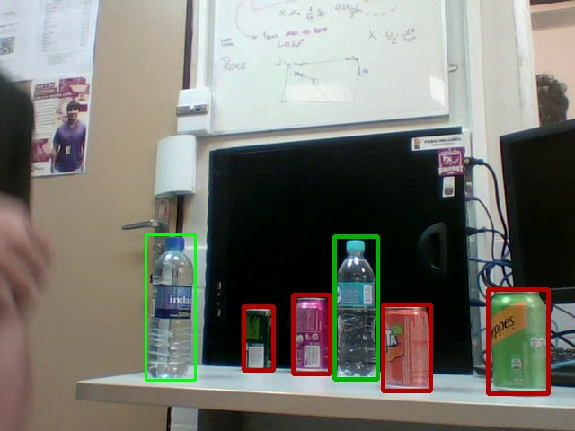

# Simple Video Annotation

> A simple Video annotation made with python + opencv for detection in yolo format



## Output Example

> https://drive.google.com/drive/folders/1jdrNOeyFmMtlrg8QWdlXW5aZy4HRXJUz

## Installation

```sh
#TODO
You will need OpenCV with ffmpeg lib
```

## Run with Docker 
### Ubuntu Version: 16.04 / Python 2.7.12 / OpenCV 3.2.0

 0. You need to install [Docker](https://docs.docker.com/install/) and clone this [project](https://github.com/CarlosPena00/SimpleVideoAnnotation).
 
 1. Build docker image (It will take something like 20 minutes or more, depends of your network speed. Because It´s pulls Ubuntu image and install all dependencies, and build OpenCV). This command only need to run once.
			
		docker build . -t "videoAnnotation:core"
 
 2. You need to make the Display exportable

		xhost +local:root

 3. Run and have fun!
	
		docker run -it --rm -e DISPLAY=${DISPLAY} -e QT_X11_NO_MITSHM=1 -v /tmp/.X11-unix:/tmp/.X11-unix videoannotation:core

 4. To pass data through container -> pc host

 		docker cp ContainerDockerNumber:/root/VideoAnnotation/ .

 5. To pass data through pc host -> container (Pass video file to container)

 		docker cp dataPathInHostPc ContainerDockerNumber:/root/VideoAnnotation/


## Usage example

```sh
python VideoAnnotation.py video.mp4
```

## Controls:

* q - Quit
* Mouse Left - Create new BoundBox, drag to change the dimension
* Mouse Right - Erase actual BoundingBox
* WASD - Move the BoundBox
* 8456 - Change width and height
* Space - Next frame
* Z - Previous 
* 79 - Change current bound box
* '/' or '*' - Change current class
* '-' - Delete the bound box
* R - Get bound box from labels.txt

## Variables -- Trackbar

* ID - Id of the label
* Jump - How many pixels WASD/8456 will change
* Skip - How many frames will be skipped

## Tree
Givem a video file, it will create:

```
.
└── VideoFolder (The same name of the video file)
    ├── Ground  (Fold of ground imagens with BoundBox)
    ├── JPEGImages (Fold of imagens without BoundBox)
    ├── labels (Fold with the .txt labels files in yolo format)
 	└──	imgList.txt (List with full directory of images inside JPEGImages folder)
```

### Label Format

    (ID) (absoluteX/imgWidth) (absoluteY/imgHeight) (absoluteWidth/imgWidth) (absoluteHeight/imgHeight)

    Example: 
	  Class Id = 0
	  absoluteX = 50  (X of the center of the BoundBox)
	  absoluteY = 50  (Y of the center of the BoundBox)
	  absoluteWidth = 100 (Width of the BoundBox)
	  absoluteHeight = 100 (Height of the BoundBox)
	  imgWidth = 400  (Image width)
	  imgHeight = 400 (Image Height)

	         0 50/400 50/400 100/400 100/400
	  Label: 0 0.125  0.125   0.25    0.25
	

### TODO
	
	1. Organize the code
	2. Make automatic BoundBox

### Please Feel Free to Contact Us!

**Carlos Pena** ([GitHub :octocat:](https://github.com/CarlosPena00))
  
  
**chcp@cin.ufpe.br**

**Heitor Rapela** ([GitHub :octocat:](https://github.com/heitorrapela))
  
  
**hrm@cin.ufpe.br**


[](https://sourcerer.io/fame/CarlosPena00/CarlosPena00/SimpleVideoAnnotation/links/0)[](https://sourcerer.io/fame/CarlosPena00/CarlosPena00/SimpleVideoAnnotation/links/1)[](https://sourcerer.io/fame/CarlosPena00/CarlosPena00/SimpleVideoAnnotation/links/2)[](https://sourcerer.io/fame/CarlosPena00/CarlosPena00/SimpleVideoAnnotation/links/3)[](https://sourcerer.io/fame/CarlosPena00/CarlosPena00/SimpleVideoAnnotation/links/4)[](https://sourcerer.io/fame/CarlosPena00/CarlosPena00/SimpleVideoAnnotation/links/5)[](https://sourcerer.io/fame/CarlosPena00/CarlosPena00/SimpleVideoAnnotation/links/6)[](https://sourcerer.io/fame/CarlosPena00/CarlosPena00/SimpleVideoAnnotation/links/7)
